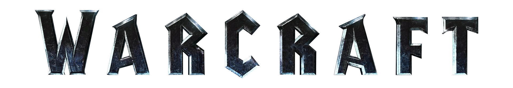

<h1 align="center">Warcraft 5th Edition</h1>

<i>A campaign supplement for Dungeons & Dragons 5th Edition</i>

This is the repository for a community project looking to build a collection of books that can be used to play *Dungeons & Dragons 5th Edition* in the World of Warcraft. We're one out of several such projects hovering around out there, and work together with some others.

***A supplement and a community.*** What we've been looking to do with this is not only to build up a set of setting sourcebooks for Dungeons & Dragons, but to bring forth a flourishing community of like-minded people looking to do the same. We have a moderately sized team working on our own material, and a community of others alongside it who are working on their own extended material, takes on the same material, adventure modules, and similar.

***Completely free of charge.*** Nothing in this project is going to cost money to access, both for legal reasons and for the fact that this for us involved is just a hobby project because we love the game and love the setting. We're basically kept in existence by the same measures that allow for Warcraft projects top exist generally.

***Always looking to improve.*** Feedback on things you think work well are always appreciated, alongside feedback on things you think could be better. Knowing what people think are good and bad things both helps us a lot with seeing the bigger picture. 

***Will update when there are updates to release.*** Things in the project happen largely at their own pace, as we're trying our best not to push each other to release updates at any particular frequency. The last thing we want to do is to burn ourselves out on this project, because at the end of the day we are just a bunch of friends with a lot of Warcraft love who want to work together to create something cool. And then share that something with others, to see what they think!

## Current Project Status 

For the Heroes' Handbook, our big focus is on fixing various class issues prior to releasing a big 3.0 update to the project. We've got some classes that have relatively minor issues that need to be sorted out, some subclasses we want to revisit, and some classes that we've been working on giving a fresh update. There's been some forking of the project and personal re-imagining of some classes that we think look really cool (and encourage for people to do; remix us to fit your taste if you want to), and important lessons that we want to learn from them. 

For the Manual of Monsters, we have a *lot* of monsters that exist somewhere in the pipeline toward a future update. We've been planning these updates very thematically for when they go into the core book, but will be releasing each "group" of statblocks in individual monsters regardless of how long until their big update is ready.

*Last edited 20. February 2021*

## Join the Conversation

Other than this Github repository, we who work on the project can be found both on Discord and on Github. Discord is where we run our own internal conversations as well, discussing different changes and delegating tasks between people in the team.

## Get the Books

Right now, all of the material in this project is available on Google Drive, as compiled PDFs. There are a number of different folders, and the contents of each one is laid out as listed below.

- 📕 **Heroes Handbook:** *(Latest version: 2.1)*
  The latest big release of the Heroes' Handbook, this project's player handbook. At the time of writing this, the book in here is technically out of date -- anything that has an update in the next folder after is what we recommend trying out.

- 📕 **HHB v3.0 Playtest:** *(Latest version: 3.0-preview-1)*
  This folder contains part-by-part playtest files for the upcoming 3.0 release of the Heroes' Handbook. We recommend trying this out, see how you like it compared to previous material, and then [tell us what you think](https://docs.google.com/forms/d/e/1FAIpQLSe0QxHjdCpTJklwZdLg5kCZTD0LSoj9NJkeBm_ZyycPPkXzpw/viewform?usp=sf_link). 😄

- 📙 **Manual of Monsters:** *(Latest version: 1.0)*
  The latest big release of the Manual of Monsters, our growing collection of creature statblocks for the setting. 

- 📙 **MoM v3.0 Playtest:** *(Latest version: 3.0-preview-1)*
  Upcoming monsters that are still being previewed, released in monster group parts. Unlike the HHB 3.0 playtest, this won't supersede what is in the *Manual of Monsters* folder; it's all additional material.

- 📗 **Theme of the Month:** 
  Material that has been submitted to the community via our monthly running *Theme of the Month* events, where we throw up a theme and throw out invitation for everyone to come along and make some fun things with us. 

## Check out Online Tools

[WC5ETools](https://orjanbp.github.io/wc5etools/) 
  A site that, at the moment, contains an online bestiary that follows the main releases of the Manual of Monsters. Development is led by one of the members of this project's core team.

# Issue Tracker and Docs

This section is a floating summary of different projects and issues tracekd here on this Github repo. You can read more about how we have the Github set up [over here](https://github.com/Jihia/Warcraft-5e-Conversion/wiki/Github-Project-Setup).

Note that 'issue' in this section means there is an Issue created for it, and is being used to either track feedback or pin a to-do for how to approach a design decision at a future point. All of these are generated using [shields.io](https://shields.io/). Only currently open issues are shown.

### General topics

### Per player class

## Changelogs

These documents contain changelogs for the big book releases, if you want to dive into detail on what has changed between one release to the next. 

* [Heroes' Handbook Changelog](https://drive.google.com/open?id=1AtTF7o6sAZZLxA75oa-96ENNNBMAJ-z7m9Y93uk4b8A)

* [Manual of Monsters Changelog](https://docs.google.com/spreadsheets/d/1487fO7RPdUbloD7NY6mdCC-yFwsU4yFHOUQ4CBqX9mE)

## Other Documents Outside of Github

These documents have been set up for the project, outside of Github, to track various parts of the project. 

* [Race Balancing](https://drive.google.com/open?id=1S-XKXMaiLtRLpeIg9t50PvvAfEajpq72MxjTqa9ZbaI)

* [Available Spells for each Class' Spell List](https://drive.google.com/open?id=1bzXzGxXFdC3zUdm8_4aURXfftixsJTStRn49fAeSDgs)

* [Project Monster Planning Document](https://docs.google.com/spreadsheets/d/1gjxgzF93LLB3q_o7QYe9xynpxkaUrkorklA7YGHSJvA/edit?usp=sharing)

# Project Team

People in this section are listed as the name by which they are known in the community. 

### Original Creators

[Jihia](https://github.com/Jihia), [TangerineThunder](https://github.com/orjanbp)

### Current Core Team

Ace Azzermeen, Geamros, Lorestalker Nemzal, MagusRogue, MythMaker, Nagash, Llamadom, Tangerine, Tyloris

### Inactive & Former Team Members

123jrf, ApolloLumina, Artipo, Auvreannia, Christinekn, ClockWorkTank, Elenus, Jih, Prometheus, Reiga, Silverblade, Tseims, Wyken

## People we want to give thanks to

*This list is in no particular order, all of these people are pretty awesome.*

Huatu Hoitou, GMKel, Quivscor, Dismana, Acely, WhiskeyNrawhal, Lintian, Forgotten Goat, Sammy, Trek2148, yingchan, Sternhawk, Jaynus, Darkraven, Silverblade, Nick L, Zeeb S. Tripe, Alzenrider, Emmia, Gingersnap, Endris, Banana Arms, Knightforce, Franciscan, and all our other community members. It's thanks to you people that we're able to do this. You rock. ♥

[I'm on this list and want to change that, or not on this list but feel I should be](https://github.com/WC5E/Warcraft-5e-Conversion/wiki/Credits-Page-Details)

# Legal

### Dungeons & Dragons 5th Edition SRD
> Permission to copy, modify and distribute the files collectively known as the System Reference Document 5.1 ("SRD5") is granted solely through the use of the Open Gaming License, Version 1.0a.
> 
> This material is being released using the Open Gaming License Version 1.0a and you should read and understand the terms of that license before using this material.

### World of Warcraft
> ©2004 Blizzard Entertainment, Inc. All rights reserved. World of Warcraft, Warcraft and Blizzard Entertainment are trademarks or registered trademarks of Blizzard Entertainment, Inc. in the U.S. and/or other countries.
